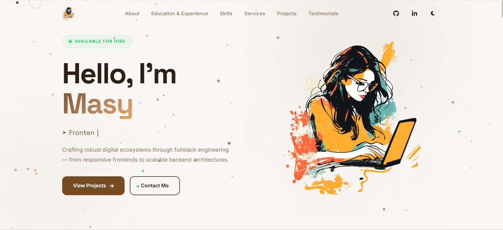

<div align="center">

# ✨ Masy Mohamed — Portfolio

### Full Stack Developer

A premium, dark-themed personal portfolio showcasing my skills, projects, and experience — built entirely with **vanilla HTML, CSS & JavaScript**.

[](https://masy-portfolio-live.vercel.app/)
[](https://github.com/masy43)
[](https://www.linkedin.com/in/masy-mohamed/)

</div>

---

## 📸 Preview

<div align="center">


 

</div>

---

## 🎯 Overview

A meticulously crafted **single-page portfolio** with cinematic visual effects, smooth animations, and a responsive design that works flawlessly across all devices. Every detail — from the custom cursor to the particle canvas background — is designed to create a **premium, immersive experience**.

### ✨ Key Highlights

| Feature | Description |
|---------|-------------|
| 🎨 **Dark / Light Theme** | Seamless theme switching with `localStorage` persistence |
| 🌌 **Particle Canvas** | Animated particle background with interactive gradient orbs |
| ⌨️ **Typing Animation** | Dynamic role typewriter effect in the hero section |
| 🖱️ **Custom Cursor** | Dot + outline cursor with magnetic hover effects |
| 📐 **Tilt Effects** | 3D parallax card tilts on project & service cards |
| 📱 **Fully Responsive** | Mobile-first design with hamburger nav and fluid layouts |
| 🎭 **Scroll Animations** | Reveal-on-scroll transitions with configurable delays |
| 🔗 **Font Awesome Icons** | Rich iconography throughout every section |

---

## 🏗️ Project Structure

```
masy/
├── index.html              # Main HTML (1,446 lines — all sections)
├── README.md               # You are here
├── src/
│   ├── css/
│   │   └── style.css       # Complete design system & responsive styles
│   ├── js/
│   │   └── main.js         # Animations, theme toggle, interactions
│   ├── images/
│   │   ├── headerPhoto.png # Hero & header avatar
│   │   ├── Aboutphoto.png  # About section photo
│   │   ├── sleek-weather/  # Sleek Weather project mockup
│   │   ├── smart-home/     # SmartHome project mockup
│   │   ├── beauty-mate/    # BeautyMate project mockup
│   │   ├── student-hub/    # StudentHub project mockup
│   │   ├── taskflow/       # TaskFlow project mockup
│   │   └── banksys/        # BankSys project mockup
│   └── icons/
│       ├── favicon.ico
│       └── Icons8/         # Skill & tech stack icons (SVG/PNG)
```

---

## 📑 Sections

| # | Section | Description |
|---|---------|-------------|
| 🏠 | **Hero** | Animated intro with typing effect, gradient text, CTA buttons, and floating photo card |
| 👤 | **About** | Personal intro with 3 highlight cards — End-to-End Engineering, Scalable Backend Systems, Performance Obsessed |
| 🎓 | **Education & Experience** | Tabbed interface (Education / Experience) with timeline cards — B.Sc. CS, HCIA-AI, DEPI, NTI, El-Araby |
| 🛠️ | **Skills** | Filterable skill mosaic (All / Frontend / Backend / Database / Tools) with 15+ technologies |
| 💼 | **Services** | Bento-grid layout — 7 service cards covering Full Stack, Frontend, Backend, Database, Auth, Performance, Deployment |
| 🚀 | **Projects** | 6 featured projects with hover overlays, tech tags, live demos, and feature modals |
| ⭐ | **Testimonials** | Client review cards with star ratings and author details |
| 📬 | **Contact** | Contact info cards (Email, Phone, WhatsApp) + message form with social links |

---

## 🛠️ Tech Stack

<div align="center">

| Layer | Technologies |
|-------|-------------|
| **Structure** | HTML5, Semantic Markup |
| **Styling** | CSS3, Custom Properties, Glassmorphism, Gradients |
| **Logic** | Vanilla JavaScript (ES6+) |
| **Fonts** | [Inter](https://fonts.google.com/specimen/Inter), [Space Grotesk](https://fonts.google.com/specimen/Space+Grotesk) |
| **Icons** | [Font Awesome 6.4](https://fontawesome.com/), [Icons8](https://icons8.com/) |

</div>

---

## 🚀 Featured Projects

<table>
  <tr>
    <td align="center" width="33%">
      <strong>Sleek Weather</strong><br/>
      <sub>HTML · CSS · JS · Leaflet.js</sub><br/>
      <a href="https://weather-app-ten-fawn-48.vercel.app/">Live Demo</a> · <a href="https://github.com/masy43/Weather-App">GitHub</a>
    </td>
    <td align="center" width="33%">
      <strong>SmartHome</strong><br/>
      <sub>NestJS · TypeScript · Node.js</sub><br/>
      <a href="https://github.com/masy43/SmartHome-Backend-nestjs">GitHub</a>
    </td>
    <td align="center" width="33%">
      <strong>BeautyMate</strong><br/>
      <sub>Node.js · Express.js · TypeScript</sub><br/>
      <a href="https://github.com/masy43/GRADUATION-PROJECT-NODEJS">GitHub</a>
    </td>
  </tr>
  <tr>
    <td align="center">
      <strong>StudentHub</strong><br/>
      <sub>HTML · CSS · JavaScript</sub><br/>
      <a href="https://student-management-system-inky-two.vercel.app/">Live Demo</a> · <a href="https://github.com/masy43/Student-Management-System">GitHub</a>
    </td>
    <td align="center">
      <strong>TaskFlow</strong><br/>
      <sub>HTML · CSS · JavaScript</sub><br/>
      <a href="https://to-do-list-omega-neon-30.vercel.app/">Live Demo</a> · <a href="https://github.com/masy43/to-do-list">GitHub</a>
    </td>
    <td align="center">
      <strong>BankSys</strong><br/>
      <sub>JavaScript · Node.js · HTML · CSS</sub><br/>
      <a href="https://banking-system-js.vercel.app/">Live Demo</a> · <a href="https://github.com/masy43/Banking-System-JS">GitHub</a>
    </td>
  </tr>
</table>

---

## ⚡ Getting Started

```bash
# Clone the repository
git clone https://github.com/masy43/masy.git

# Navigate into the project
cd masy

# Open in browser (no build step needed!)
# Option 1 — Double-click index.html
# Option 2 — Use Live Server (VS Code extension)
# Option 3 — Use any static server:
npx serve .
```

> **Zero dependencies.** No npm install. No bundler. Just open `index.html` and go.

---

## 🎨 Customization

| What | Where |
|------|-------|
| **Colors & Theme** | CSS custom properties in `src/css/style.css` (`:root` block) |
| **Personal Info** | `index.html` — Hero section, About section, Contact section |
| **Projects** | `index.html` — `#projects` section (add/remove `.proj-card` blocks) |
| **Skills** | `index.html` — `#skills` section (add/remove `.skill-card` blocks) |
| **Typing Words** | `src/js/main.js` — Update the typing animation array |
| **Photos** | Replace files in `src/images/` |

---

## 📄 License

This project is open source and available under the [MIT License](LICENSE).

---

<div align="center">

**Built with ❤️ by [Masy Mohamed](https://github.com/masy43)**

_Crafting robust digital ecosystems through fullstack engineering —_
_from responsive frontends to scalable backend architectures._

[](mailto:masym32@gmail.com)
[](https://wa.me/201067051818)
[](https://www.linkedin.com/in/masy-mohamed/)

</div>
