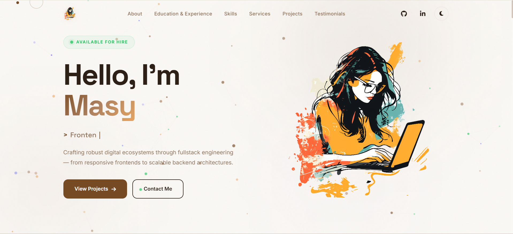

<div align="center">

# ✨ Masy Mohamed — Portfolio

### Full Stack Developer

A premium, dark-themed personal portfolio showcasing my skills, projects, and experience — built with **React.js**, **Vite**, and **Tailwind CSS**.

[](https://masy-portfolio-live.vercel.app/)
[](https://github.com/masy43)
[](https://www.linkedin.com/in/masy-mohamed/)

</div>

---

## 📸 Preview

<div align="center">

 

</div>

---

## 🎯 Overview

A meticulously crafted **single-page portfolio** built with a modern React component architecture, smooth animations, and a responsive design that works flawlessly across all devices. Every detail — from the custom cursor to the particle canvas background — is designed to create a **premium, immersive experience**.

### ✨ Key Highlights

| Feature                   | Description                                                                      |
| ------------------------- | -------------------------------------------------------------------------------- |
| ⚛️ **React 19**           | Component-based architecture with hooks, context API, and clean state management |
| ⚡ **Vite 6**             | Lightning-fast dev server and optimized production builds                        |
| 🎨 **Tailwind CSS 3.4**   | Utility-first styling with custom theme extending CSS variables                  |
| 🌗 **Dark / Light Theme** | Seamless theme switching via React Context with `localStorage` persistence       |
| 🌌 **Particle Canvas**    | Animated particle background with interactive gradient orbs                      |
| ⌨️ **Typing Animation**   | Custom `useTypingEffect` hook powering the hero typewriter                       |
| 🖱️ **Custom Cursor**      | Dot + outline cursor with lerp-based tracking and hover effects                  |
| 💎 **Premium UI**         | Glassmorphism, floating orbs, gradients, and shimmer effects                     |
| 📱 **Fully Responsive**   | Mobile-first design with hamburger nav and fluid layouts                         |
| 🎭 **Scroll Animations**  | Custom `useScrollReveal` hook with IntersectionObserver and configurable delays  |
| 🔗 **Font Awesome Icons** | Rich iconography throughout every section                                        |

---

## 🏗️ Project Structure

```
react-portfolio/
├── index.html                    # Entry HTML with CDN fonts & icons
├── package.json                  # Dependencies & scripts
├── vite.config.js                # Vite configuration
├── tailwind.config.js            # Tailwind CSS theme & custom animations
├── postcss.config.js             # PostCSS with Tailwind & Autoprefixer
├── public/
│   ├── images/
│   │   ├── headerPhoto.png       # Hero avatar & favicon
│   │   ├── Aboutphoto.png        # About section photo
│   │   ├── sleek-weather/        # Project mockups
│   │   ├── smart-home/
│   │   ├── beauty-mate/
│   │   ├── student-hub/
│   │   ├── taskflow/
│   │   └── banksys/
│   └── icons/
│       └── Icons8/               # Skill & tech stack icons
└── src/
    ├── main.jsx                  # React entry point
    ├── App.jsx                   # Root component with modal state
    ├── index.css                 # Tailwind directives, CSS variables, animations
    ├── data/
    │   └── portfolio.js          # All content data (skills, projects, services, etc.)
    ├── context/
    │   └── ThemeContext.jsx       # Dark/light theme provider
    ├── hooks/
    │   ├── useScrollReveal.js    # IntersectionObserver scroll animations
    │   └── useTypingEffect.js    # Typing/deleting text animation
    └── components/
        ├── CustomCursor.jsx       # Animated dot + outline cursor
        ├── GlobalBackground.jsx   # Canvas particles & gradient orbs
        ├── ScrollProgress.jsx     # Fixed top progress bar
        ├── Header.jsx             # Navbar with scroll effects & mobile menu
        ├── Hero.jsx               # Typing effect, CTA, floating card
        ├── About.jsx              # Photo & highlight cards
        ├── EducationExperience.jsx # Timeline layout
        ├── Skills.jsx             # Filterable skill grid
        ├── Services.jsx           # Bento grid service cards
        ├── Projects.jsx           # Project showcase with modal trigger
        ├── Testimonials.jsx       # Marquee carousel & stats
        ├── Contact.jsx            # Contact form with Gmail redirect
        ├── Footer.jsx             # Copyright & back-to-top
        └── Modal.jsx              # Feature list overlay
```

---

## 📑 Sections

| #   | Section                    | Description                                                                                                         |
| --- | -------------------------- | ------------------------------------------------------------------------------------------------------------------- |
| 🏠  | **Hero**                   | Animated intro with typing effect, gradient text, CTA buttons, and floating photo card                              |
| 👤  | **About**                  | Personal intro with 3 highlight cards — End-to-End Engineering, Scalable Backend Systems, Performance Obsessed      |
| 🎓  | **Education & Experience** | Dual-column vertical timeline with glassmorphism cards, animated connectors, and scroll-triggered entrance effects  |
| 🛠️  | **Skills**                 | Filterable skill mosaic (All / Frontend / Backend / Database / Tools) with 15+ technologies                         |
| 💼  | **Services**               | Bento-grid layout — 7 service cards covering Full Stack, Frontend, Backend, Database, Auth, Performance, Deployment |
| 🚀  | **Projects**               | 6 featured projects with hover overlays, tech tags, live demos, and feature modals                                  |
| ⭐  | **Testimonials**           | Infinite marquee carousel with glassmorphic cards, rating stats, and smooth edge fading                             |
| 📬  | **Contact**                | Premium contact section featuring a hero banner with floating orbs, glassmorphic form, and interactive inputs       |

---

## 🛠️ Tech Stack

<div align="center">

| Layer         | Technologies                                                                                                       |
| ------------- | ------------------------------------------------------------------------------------------------------------------ |
| **Framework** | React 19, Vite 6                                                                                                   |
| **Styling**   | Tailwind CSS 3.4, PostCSS, CSS Custom Properties                                                                   |
| **State**     | React Context API, Custom Hooks                                                                                    |
| **Fonts**     | [Inter](https://fonts.google.com/specimen/Inter), [Space Grotesk](https://fonts.google.com/specimen/Space+Grotesk) |
| **Icons**     | [Font Awesome 6.4](https://fontawesome.com/), [Icons8](https://icons8.com/)                                        |

</div>

---

## 🚀 Featured Projects

<table>
  <tr>
    <td align="center" width="33%">
      <strong>Sleek Weather</strong><br/>
      <sub>HTML · CSS · JS · Leaflet.js</sub><br/>
      <a href="https://weather-app-ten-fawn-48.vercel.app/">Live Demo</a> · <a href="https://github.com/masy43/Weather-App">GitHub</a>
    </td>
    <td align="center" width="33%">
      <strong>SmartHome</strong><br/>
      <sub>NestJS · TypeScript · Node.js</sub><br/>
      <a href="https://github.com/masy43/SmartHome-Backend-nestjs">GitHub</a>
    </td>
    <td align="center" width="33%">
      <strong>BeautyMate</strong><br/>
      <sub>Node.js · Express.js · TypeScript</sub><br/>
      <a href="https://github.com/masy43/GRADUATION-PROJECT-NODEJS">GitHub</a>
    </td>
  </tr>
  <tr>
    <td align="center">
      <strong>StudentHub</strong><br/>
      <sub>HTML · CSS · JavaScript</sub><br/>
      <a href="https://student-management-system-inky-two.vercel.app/">Live Demo</a> · <a href="https://github.com/masy43/Student-Management-System">GitHub</a>
    </td>
    <td align="center">
      <strong>TaskFlow</strong><br/>
      <sub>HTML · CSS · JavaScript</sub><br/>
      <a href="https://to-do-list-omega-neon-30.vercel.app/">Live Demo</a> · <a href="https://github.com/masy43/to-do-list">GitHub</a>
    </td>
    <td align="center">
      <strong>BankSys</strong><br/>
      <sub>JavaScript · Node.js · HTML · CSS</sub><br/>
      <a href="https://banking-system-js.vercel.app/">Live Demo</a> · <a href="https://github.com/masy43/Banking-System-JS">GitHub</a>
    </td>
  </tr>
</table>

---

## ⚡ Getting Started

```bash
# Clone the repository
git clone https://github.com/masy43/masy.git

# Navigate into the React project
cd masy/react-portfolio

# Install dependencies
npm install

# Start development server
npm run dev

# Build for production
npm run build

# Preview production build
npm run preview
```

> **Dev server** runs at `http://localhost:5173/` with hot module replacement.

---

## 🎨 Customization

| What               | Where                                                               |
| ------------------ | ------------------------------------------------------------------- |
| **Colors & Theme** | CSS variables in `src/index.css` (`:root` block)                    |
| **Tailwind Theme** | `tailwind.config.js` — colors, fonts, animations                    |
| **Personal Info**  | `src/components/Hero.jsx`, `About.jsx`, `Contact.jsx`               |
| **Projects**       | `src/data/portfolio.js` — `projects` array                          |
| **Skills**         | `src/data/portfolio.js` — `skills` array                            |
| **Services**       | `src/data/portfolio.js` — `services` array                          |
| **Typing Words**   | `src/components/Hero.jsx` — roles array passed to `useTypingEffect` |
| **Photos**         | Replace files in `public/images/`                                   |

---

## 📄 License

This project is open source and available under the [MIT License](LICENSE).

---

<div align="center">

**Built with ❤️ by [Masy Mohamed](https://github.com/masy43)**

_Crafting robust digital ecosystems through fullstack engineering —_
_from responsive frontends to scalable backend architectures._

[](mailto:masym32@gmail.com)
[](https://wa.me/201067051818)
[](https://www.linkedin.com/in/masy-mohamed/)

</div>
